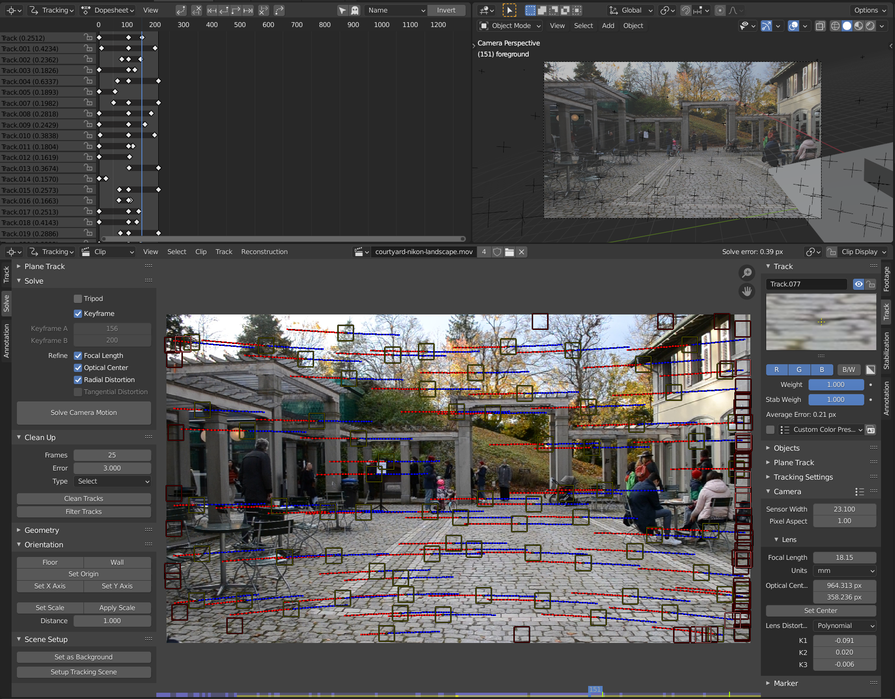
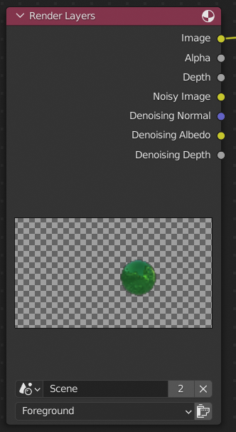
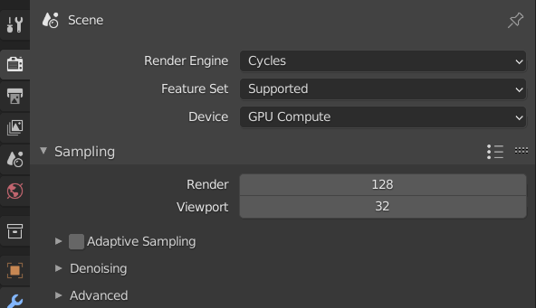

Motion tracking
===============

I started with CG Geek's ["Yes.. VFX is THIS Easy (Blender Tutorial)"](https://www.youtube.com/watch?v=-BYH5pDYakk) but while I enjoy his videos I'm not sure if it's the best introduction.

Videos that I found useful:

* Blender Daily's
  * ["Add Cars to your Videos with Blender!"](https://www.youtube.com/watch?v=88S6gBFLkdo)
  * ["Camera Tracking with Blender for Beginners!"](https://www.youtube.com/watch?v=O67P0uzbQBk)
  * ["Add 3d Objects to Photos with Blender!"](https://www.youtube.com/watch?v=Cf8Ma5hy9hU)
* CGMatter/Default Cube's
  * ["Motion tracking #1: Everything you need to know."](https://www.youtube.com/watch?v=WLSGG7sDEac)
  * ["Put 3D Objects in Any Photo"](https://www.youtube.com/watch?v=aknsCszvMdA)
* Ian Hubert's ["Blender Motion Tracking - Room Transformation!"](https://www.youtube.com/watch?v=lY8Ol2n4o4A)
* ASA Art 3d's ["Video motion tracking and FSPY."](https://www.youtube.com/watch?v=M2IVU14T16s)

Shooting footage
----------------


I set out to shoot some footage with my old [Nikon D3100](https://en.wikipedia.org/wiki/Nikon_D3100) DSLR. This proved trickier than I first imagined - getting the settings right and avoiding some well known issues (well known to people who've done this before) required some experimentation.

### Rolling shutter

I tended to pan about in my shots and this makes an effect called [rolling shutter](https://en.wikipedia.org/wiki/Rolling_shutter) very clear. There's no end of advice on the web on how to avoid this, e.g. mounting the camera at 90° to the direction of pan (which has the obvious downside that you get portrait footage when you would otherwise have landscape). In the end, the best advice seemed to be to choose a shutter speed that's at least double your frame rate (as Adobe advice [here](https://www.adobe.com/creativecloud/video/discover/rolling-shutter-effect.html) in the section "Master your shutter speed") and to pan about as slowly as you can (or go for a [shaky-cam](https://en.wikipedia.org/wiki/Shaky_camera) look where effects like rolling shutter are lost in all the other movement).

**Update:** in the end, I don't think the effect I was seeing was the result of rolling shutter but instead of the lens's vibration reduction being confused by the smooth pan. It seems that for certain movements, e.g. a smooth pan, the vibration reduction actually introduces a popping effect - it tries to compensate for the movement but as you pan beyond a certain distance it gives up but then immediately starts trying again before it again gives up and so on. Some lenses can detect panning or have a special panning mode but for my lens, I think the proper solution is to disable vibration reduction.

### Eyepiece cap

There were a few other simple things, e.g. (as covered in the Nikon manual), you need to cover the viewfinder to stop light leaking when operating in movie mode (called live-view by Nikon):


### Depth of field

For portrait photography, low depth-of-field (DoF) is popular (i.e. clear subject and blurry background). However, for tracking high DoF makes things a lot easier, i.e. as much as possible stays in focus throughout any clip and markers are clear and easy to follow from one frame to the next.

I read that aperture is very important for high DoF so initially I obsessed about using a small aperture value, e.g. f/16. But a small aperture lets in much less light which means your exposure times need to be longer - which is problematic if you're already confined in your choice of shutter speed by a desire to avoid rolling shutter as described above and problematic as, beyond a certain shutter speed, it's difficult to hold the camera steady enough while each image is being taken.

However, in the end I found that it's the combination of focal length, aperture and nearness to the subject that really matter. If you're zoomed in at 55mm then the difference between an aperture of f/5 and f/16 is huge - however, for a scene like the courtyard one above at 18mm the difference between f/5 and f/16 is small.

| f/5 | f/10 | f/16 |
|-----|------|------|
|  |  |  |

### Final settings for shutter speed and focal length

So I gave up worrying about aperture and just kept my focal length low (18mm) and my shutter speed at 1/60s or faster.

On my Nikon this involved setting my 18-55mm lens to 18mm and selecting _Shutter Priority_ mode and dialing in 1/60:


### Auto-focus

Initially, I was disturbed that the default setting was that auto-focus didn't work continuous during a shot. Instead, you focus and then start shooting (with the focus staying fixed from then on). It is actually possible to get my Nikon to focus continuously, what they call AF-F (full-time servo auto-focus). I tried this and the results were very unsatisfactory - the refocusing isn't very quick and things look very poor while it's adjusting focus. It's better to just choose a focal length etc. that don't require changes in focus. In fact, I found this seems to be the general advice even when using very high-end equipment, i.e. focus once and stick with that rather than trying to refocus during a shot.

So with the Nikon, you simply hold shutter-release button to focus on the primary subject of your scene, it adjusts and beeps once done, and then you start shooting.

### Camera settings

Some camera settings depend on your current mode - I chose _Shutter Priority_ and then adjusted my settings. There's a lot of advice on the web as to what camera settings to use for the best movie results. In the end, I found that most of the camera's default settings were actually the most appropriate. The only things, I changed were:

* ISO sensitivity: 100 with auto ISO sensitivity on (and max sensitivity set to 3200 and min shutter speed set to 1/30)
* Auto-distortion control: on
* Noise reduction: off

Everyone says you should choose the lowest ISO sensitivity you can get away with. The camera already defaults to the lowest value (ISO 100) but doesn't enable auto ISO sensitivity. I enabled this as, I reasoned, there was no point not letting the camera reduce the sensitivity if it otherwise couldn't get a reasonable shot.

I enabled auto-distortion control - I don't know why this isn't on by default. It should work with all modern Nikon camera lens (as far as I understand it's only older non-electronic lenses that don't support this feature). There appears to be no cost or negative side effects to enabling this feature.

I turned noise reduction off - as far as I understand, we want the truest picture possible for motion tracking - so it's not a good idea to let the camera apply noise reduction algorithms that will smooth out everything in the process of reducing noise. If we want to reduce noise we can do that ourselves in post-processing.

For reference, everything else was set as follows (all of these are the default values, except image quality which defaults to normal but this isn't relevant to movie shooting):

* Picture Control: standard
* Image quality: fine
* Image size: large
* White balance: auto
* Active D-Lighting: on
* Color space: sRGB
* AF-area mode: auto-area (viewfinder) and wide (live-view)
* AF-assist: on
* Metering: matrix
* Movie settings: 1080p (quality) and sound on
* Built-in flash: TTL

Under the _Setup Menu_ I have:

* Video mode: PAL
* Flicker reduction: 50Hz

I don't believe either of these affect what's recorded. Video mode is just relevant when playing video directly from the camera to a TV (e.g. a PAL one in Europe or an NTSC one is the US). And flicker reduction is about reducing flicker in the cameras LCD monitor when the main light source is electrical (which has a characteristic flicker - 50Hz in Europe and 60Hz in the US) - the camera manual specifically says this effect "will not appear in the final picture".

Note: in the manual, in the "Recording and Viewing Movies" section, it says "matrix metering is used regardless of the metering method selected. Shutter speed and ISO sensitivity are adjusted automatically". This implies that, at a minimum, our metering, shutter speed and ISO settings have little or no impact. In practice though I'm not sure what that means - if I select a particular shutter speed or ISO speed then I very clearly see this shown as part of the movie settings when filming and when reviewing the clip on the camera. I don't know if it simply means that these settings are taken as input or guidance but that the camera ultimately controls these values during shooting.

### Getting a smooth pan

I took my first shots using a tripod and just panning from left-to-right across my scene. I thought this would produce smooth stable results that would be good for tracking. I was wrong on the smooth front and wrong that this kind of motion would be good for tracking.

It turns out that motion tracking works much better if everything is moving relative to everything else, i.e. it's clear that things in the background are moving relative to those in the foreground. And a pan actually results in very little [parallax], i.e. the kind of relative motion that we want. You have to actually enable a special tripod solver so handle footage shot using one. 

So walking through a scene will produce easier to solve data than a pan from a tripod (but walking about introduces its own problems, see the next section).

See this great [Blender StackExchange answer](https://blender.stackexchange.com/a/42332/124535) for details of types of camera movement and the consequences for solving.

The other thing that surprised me about panning with a tripod is that it's almost impossible to do smoothly. I have a cheap tripod like this (Amazon Basics, Cullmann and Hama have a near identical mode):


Even if you hang a weight off the center hook (to keep the tripod stable) and try your best to turn the panning handle smoothly and slowly, the results are _really_ jerky. Because everything else is stable, you really notice the tiny shakes of your hand and inconsistency in speed. You quickly realize why professionals pay upward of US$250 for something like a [Syrp Genie Mini II](https://www.manfrotto.com/global/genie-mini-ii-sy0033-0001/), i.e. use a motor to achieve a smooth pan.

Like rolling shutter, this is a super well known issue and again there are no end of videos on how to address it. There are lots of expensive options - in addition to the Genie Mini, you can buy a much more expensive tripod head (and a tripod that can take interchangeable heads) designed for more fluid movement and to damp shake, e.g. this US$200 [Manfrotto 200AH](https://www.manfrotto.com/global/502-fluid-video-head-with-flat-base-mvh502ah/) head.

A cheaper alternative is to make your panning handle much longer. I strapped a 1m long aluminum tube (actual square in cross-section), bought in a hardware store, to the handle of my tripod. The arc described by the end of the tube, when doing a pan, is obviously much longer than made with the tripod handle, making it easier to maintain a constant speed with less jerkiness.

You still get shake though - your hand is always shaking a little (even if you're not yet geriatric) and the easiest way to smooth this out seems to be by pulling the handle using some rubber bands rather than pulling it directly with your hand. The rubber bands introduce an element of damping - smoothing out the slight shaking of your hand.

Hai Tran describes this approach here (using a hairband rather than a rubber band) [here](https://www.youtube.com/watch?v=_2B-66nN23M&t=46s) (46s in to his video "How to get Smooth Pans and Tilts"). And Dom Bower describes the same thing [here](https://www.youtube.com/watch?v=zo0nrVNvB80&t=24s) in more detail (24s in to his video "Secret to Perfectly SMOOTH Panning and Tracking") - in his video he's using a camera slider rather than a panning head but the principle is the same.

### Not using a gimbal

These days there are no end of ads for gimbals to smooth out your motion (if you're not specifically looking the aforementioned shaky-cam look). Instead, I looked for advice on getting steadier footage without using a gimbal. It basically seems to come down to two obvious things - holding the camera well and moving well.

You want to hold the camera firmly with two hands with your posture, i.e. location of elbows, etc. designed to minimize shake. Ideally, in addition to one hand on the camera body and one on the lens, you also have a third point of contact, e.g. you've got the camera pulled against you either braced against your face or chest. In the end I chose having the camera strap taut against my neck as the third point of contact. It looks a little weird but so what!

Peter McKinnon describes the camera strap approach [here](https://youtube.com/watch?v=59dl-mhQWBA&t=149s) (2m 29s into his video "Shaky Footage? How to get SMOOTH HANDHELD shots like a beast!").

And you want to walk such that you minimize hard impacts as the feet come down and minimize the normal up-and-down motion. Crouch down a little, bending your knees and walk on the balls of your feet without heel contact. Jesse Driftwood describes exactly this approach [here](https://www.youtube.com/watch?v=Bj24pdXrGx4&t=401s) (6m 31s into his video "Don’t buy a gimbal! Tips for shooting video handheld.").

I'd be curious to see how the footage from my now quite old Nikon, which has a large sensor and substantial optics, compares with the footage from e.g. a [DJI Pocket 2](https://www.dji.com/ch/pocket-2). The Pocket 2's sensor and optics are obvious tiny in comparison with the Nikon but its whole purpose is to take smooth video.

Interestingly, Nigel Barros, [here](https://www.youtube.com/watch?v=__q0yrbbaUo&t=104s) (1m 44s into his video "Smooth Video Without A Gimbal"), gives very different advise to Peter McKinnon - he only goes for two points on contact and a very loose light hold (gliding along, smoothing out rather than transferring motion from the rest of the body) and he goes for a heel-toe walk (rather than on the balls of his feet). The results shown are very smooth.

**Update:** it turns out everyone has their own take on how to do things, some hold the camera tight to their body or tensioned against their neck with a camera strap while others hold the camera loosely and away from their body. So I guess it's up to you to work out what works for you. Other videos I liked were:

* [The Gimbal Walk](https://www.youtube.com/watch?v=E5rK7K7AU1c) - Xiaoyu Yang shows you how to walk like a ninja.
* [Smooth Gimbal Shots | Ninja Walk like a PRO!](https://www.youtube.com/watch?v=Suydi7lZSOs) - Richard teaches his partner how to ninja walk.
* [Take light steps](https://www.youtube.com/watch?v=LdrWf7mq9Qg&t=473s) - 7m 53s into his video "SHOOT BETTER HANDHELD", Mark Bone discusses taking light steps and holding the camera _away_ from his body.

After watching a lot of these videos, my impression is that it _may_ be possible to do without a gimbal if one if shooting at 60fps but playing back at 24fps (slowing down the motion also slows out your wobbles making it feel smoother) or if e.g. staying stationary and just swivelling your torso to create a pan. But if you're walking around and want real-time rather than dreamy slo-mo then I suspect you'll have to use a gimbal.

Gimbal
------

Currently (early 2022), the cheapest well regarded gimbal suitable for a DSLR seems to be the [Zhiyun Weebill-S](https://www.zhiyun-tech.com/en/product/detail/70).

Xiaoyu Yang (in her video linked to above) also suggests something like this [spring dual-handle grip](https://www.aliexpress.com/item/32908621796.html) (also [here](https://www.bhphotovideo.com/c/product/1434067-REG/digitalfoto_solution_limited_ares_alloy_spring_dual_handle.html)) to compensate for up-down motion (e.g. while walking - even with the ninja walk). Note that from reviews, it seems that you will have to adjust the springs to match the weight of your setup - otherwise it will actually introduce more movement rather than reduce it.

What is tracking?
-----------------

It should be clear what tracking is once we start playing with it in Blender. But before we start doing that, I'll just cover one thing that confused me initially.

Once you've _solved_ your scene (we'll come to solving later), you end up with a set of points in 3D space that correspond to points in your scene. Initially, I thought this was the purpose of the whole thing and that achieving a set of points that matched my understanding of the scene was the goal of the thing.

It is not! The goal of the thing is to solve for the original motion of your camera within 3D space when you were taking the clip, i.e. where was the camera and how was it oriented as each frame was taken.

In the end, you'll be able to watch your camera moving around and turning one way or another in Blender's representation of 3D space. If you didn't already know the focal-length used when shooting the footage, you'll be able to solve for this too (along with optical center and lens distortion).

Once you've reconstructed the movement of the camera, the clip will run as a background to what the camera sees. You may perceive the video as a 3D scene but it's important to realize that from Blender's point of view it's just a flat 2D image that it adds in as the background to what the camera sees as it moves.

So this is completely different to what you're trying to achieve with [photogrammetry](https://en.wikipedia.org/wiki/Photogrammetry) (where you try to reconstruct 3D objects from a collection of 2D photos) and tools like [Meshroom](https://alicevision.org/) or [RealityCapture](https://www.capturingreality.com/).

It doesn't necessarily matter that the solved points don't correspond to your understanding of the 3D space. E.g. if you solve for a scene shot with a tripod then all the points end up on what's essentially the inside of an invisible tube:


It's as if there was a giant curved cinema screen in the background and as the camera panned left to right it just saw a 2D scene on this screen rather than a 3D world. From the cameras point of view it makes no difference and for us, it makes no difference either - it's just important that we've recovered the original motion of the camera synced with the frames it took at the time.

Getting started
---------------

Open _VFX_ rather than the usual _General_:


This starts with a completely different set of workspaces, with the _Motion Tracking_ one opened by default.

Open your movie in the _Movie Clip_ editor:


Note: if you ever move your `.blend` file or clip such that the Blender loses the relationship between the two, you need to locate the clip via the _File Path_ field in the left-hand _Footage_ tab rather than via the _Open Clip_ button above the movie clip (which will set up a completely new tracking scene rather than adding a clip into the current tracking scene).

The default layout consists of one _3D Viewport_ (upper right) and three _Tracking_ editors, each in a different view mode - the top one is in _Dopesheet_ mode, the middle one in _Clip_ mode and the bottom one in _Graph_ mode.

Below the clip, you see a purple line, called the [_timeline_](https://docs.blender.org/manual/en/latest/editors/clip/main_view.html), and the little blue box, called the _playhead_. The playhead contains the current frame number and you can drag it back and forward to move to any frame.

**Update:** there's actually a fifth editor in this workspace - right at the bottom is a _Timeline_ editor (unrelated to the _timeline_ just discussed) - it's been shrunk down so you just see its title bar containing the play forward and backward buttons etc.

Footage properties
------------------

Initially, I was confused by the various panels in which you seem to see data about the same thing. Some guides to tracking mention the _Output_ properties tab - irrespective of the clip that you load, it displays _Resolution_ corresponding to 1080p, a _Frame Rate_ of _24 fps_ and 1 to 250 as the _Frame Start_ to _End_ range.  You also see 1 and 250 as the _Start_ and _End_ values in the bottom-left of the bottom _Tracking_ editor.

It turns out that the only thing actually displaying data about your clip is the _Footage_ tab in the middle _Tracking_ editor. It correctly displays the clip's dimension, frame rate and number of frames.


Press _Set Scene Frames_ and both the _Output_ properties and the bottom _Tracking_ editor will update to match the actual clip. You can adjust these values, if you want to clip off any frames from the start or end of the clip.


Then press _Prefetch_, this prefetches all frames from disk and makes [scrubbing](https://clipchamp.com/en/blog/video-scrubbing/) though the clip much faster. You'll see the timeline go a brighter shade of purple as the frames are fetched.

Note: I used the lossless [FFV1](https://en.wikipedia.org/wiki/FFV1) codec for my clips and prefetching made little obvious difference. However, if you're using a format like [H.264](https://en.wikipedia.org/wiki/Advanced_Video_Coding) it makes a big difference.

Note: you have to press _Prefetch_ each time you reopen the file, it doesn't remember that you want prefetching for a particular `.blend` file. Always move the _playhead_ to frame 1 before fetching - for whatever reason it fetches backward and forward from the current frame and it's painfully slow when it has to fetch backwards.

**Update:** using proxies rather than _Prefetch_ seems a better option especially if you're working with more than 2 or 3 hundred frames.

**Update 2:** using proxies affects _Detect Features_, i.e. it seems to work off the proxy rather than the underlying data. So maybe proxies are of limited value for tracking. If you switch _Proxy Size_ to _None, full render_, click _Detect Features_ and then switch back to a 25% proxy, the tracking _seems_ to work on the underlying data, i.e. you get a good track, but this certainly makes things less convenient.

The _Output_ properties only come into play much later when you're ready to generate a new clip (containing the 3D objects etc. that you've added after finishing with tracking). But you might as well set the _Resolution_ and _Frame Rate_ now to match your input clip. I'm assuming that it isn't mandatory that they match - e.g. you might choose to produce a 1080p output clip despite having a 4K clip or you might choose to decrease the frame rate from the 50 FPS you got from an action cam to the 24 FPS typically used for TV or movies.

**Update:** it isn't true that _Output_ properties only come into play later - try setting the _Frame Rate_ to twice the actual frame rate and press the play button (or just press space when the mouse is in the mouse is over the movie clip). So make sure the _Output_ properties match the details in the _Footage_ tab (it seems odd there isn't a button to automatically copy over these details).

One odd thing that every guide mentions, is that the default color management isn't correct for most people.

Go to _Render_ properties, expand the _Color Management_ tab and change _View Transform_ from _Filmic_ to _Standard_ - you'll see a dramatic change in the color rendering of your clip.

Note: this affects all setups, not just movie clips. If you're e.g. working on the famous Donut tutorial and chose a color for something with a color picker, the resulting color in the _3D Viewport_ will be somewhat different - this is because the _3D Viewport_ is using _Filmic_ (unless you changed it).


Note: if you later switch to _Cycles_, this setting will still remain set to _Standard_ (as you would want).

Movie files vs image sequences
------------------------------

Many tutorials say you should convert your file to an image sequence and work with that rather than the raw video file.

I've found that for small video files (where you can prefetch every frame), sticking with video works fine. If you're tracking backwards and it seems to be going extremely slowly then you probably do need to switch to an image sequence.

Try this - start Blender, choose _VFX_ and open your video file, click _Set Scene Frames_, then _Prefetch_ and then play it all the way through. Once that's done, pause it and jump to the last frame and play it backwards. If the backwards playing is incredibly slow then its because all the frames couldn't fit into the video sequencer cache and you should definitely use an image sequence instead.

For a sample video file, try the file `Footage.mp4` found [here](https://drive.google.com/drive/folders/1WHNNXcz74CZb4kF51ZqYNloraMeQHtJd) (it's the footage that accompanies Blender Daily's "Add Cars to your Videos with Blender!" [tutorial](https://www.youtube.com/watch?v=88S6gBFLkdo)). On my machine it plays back very slowly if my video sequence cache is the default 4GiB (and crashes in 3.0.0 due a bug that's been fixed for later releases) but plays back fine if I increase the cache size to 16GiB.

It turns out that playing a video backwards is far more complicated than one might imagine - lookup how keyframes and the reconstruction of individual frames work. Perhaps it's possible by constructing indexes into the underlying byte sequence but it's not something supported by popular video applications like [VLC](https://www.videolan.org/vlc/) (if you Google for VLC and backward playback, you'll see that the general sentiment is that it's too complicated for such a niche feature and if you really want this you should encode a backward version of your video). Quicktime does support backward playback (jump to the end of the video and press command and right-arrow) but it works terribly for videos such as the `Footage.mp4` one linked to above.

You might ask "can't I re-encode my videos to contain more keyframes?" Well you could but if you're going to re-encode your video and preserve the image quality then you'll have to use something like [FFV1](https://en.wikipedia.org/wiki/FFV1) which is not much different to a sequence of PNGs wrapped up into video file. So why bother - just work with the raw image sequence.

So if you decide to use image sequences, you can load your video into Blender and then export it out as a video sequence. But it's simpler just to use `ffmpeg` to convert your video file to an image sequence:

```
$ mkdir frames
$ ffmpeg -i my-video.mp4 frames/frame-%04d.png
$ ls -x frames
frame-0001.png  frame-0002.png  frame-0003.png  frame-0004.png ...
```

Proxies
-------

**TLDR;** proxies introduce their own issues and if you're dealing with a few hundred frames of 1080p video of a hundred frames of 4K, they're probably not worth using. But they do use up significantly less video sequencer cache and they can be far quicker for scrubbing around and playback particularly for 4K video. However, tracking still needs to work with the underlying high-quality data, so while proxies may help with playback, you will still need to increase the video sequencer cache size for tracking on larger files.

Prefetching has its limitations:

* You have to remember to do it every time you open the `.blend` file.
* It consumes large amounts of memory, e.g. loading an 81MiB 1080p H.264 video caused Blender to jump from a [RSS](https://en.wikipedia.org/wiki/Resident_set_size) of around 331MiB to 4348MiB, i.e. it expanded to about 4GiB in memory.
* There seem to be limits to how much Blender can prefetch - on my system, Blender simply stops prefetching for aforementioned file after about 500 frames (517 oddly), so that 4GiB isn't even for the full video.
* Blender often crashes when working with large video files - this may be a Linux / Blender 3.0 issue as many people seem to be working with large video files in Blender. However, I found that playback with large video files predictably crashed (e.g. on going over a particular frame number).

**Update:** the crashes I saw seem to be the result of a bug that surfaced in 3.0.0 and will be resolved in 3.0.1 (the fix is already available in the 3.1-alpha) - see bug report [T94615](https://developer.blender.org/T94615).

All these problems are addressed with proxies - at the cost of image quality when working with the files (but not in the final rendered result).

So, in the right-hand _Footage_ tab, tick and expand the _Proxy/Timecode_ section, leave the main settings as they are (i.e. 25% selected for _Build Original_, 50 for _Quality_) and set _Timecode_ to _Record Run_ and _Proxy Size_ to 25%. Then press _Build Proxy / Timecode_.

For a given clip you can build proxies at different resolutions, you can select the resolutions you want with _Build Original_ (before pressing the _Build_ button) and then use the _Proxy Size_ field below to say which of these resolutions you want to use currently in playback. If you select _None, full render_ for _Proxy Size_ then you see the original highest quality image (but obviously, if you then scrub around or play the video, you have all the problems of unproxied video).

By default, _Timecode_ is set to _None_. Often, this is unproblematic but there may be problems when seeking about in unprocessed video straight from a camera. Setting it to _Record Run_ tells Blender to construct its own timecode data. Note: the other _Timecode_ values, i.e. _Free Run_ etc., are for more unusual cases (like damaged video data).


For more documentation, see [here](https://docs.blender.org/manual/en/3.0/editors/clip/sidebar.html).

Note: as well as _Build Original_, there's _Build Undistorted_ - it becomes relevant _if_ you correct for lens distortion. See the section on "proxies and distortion" below and see the [documentation](https://docs.blender.org/manual/en/3.0/render/cameras.html#background-images) for more information.

Aside: the proxy data is written in the same directory as your original video file, it's stored in a subdirectory called `BL_proxy`:

```
$ ls BL_proxy/my-video.mkv
free_run.blen_tc  interp_free_run.blen_tc  proxy_25.avi  record_run.blen_tc  record_run_no_gaps.blen_tc
```

Interesting to see that `_tc` files are produced for every timecode option , i.e. _Record Run_, _Free Run_ etc. So, I guess, like _Proxy Size_, the _Timecode_ setting is about selecting what you want used for current playback etc. (and doesn't affect the proxy data that's created).

### Experimenting with proxy resolutions and quality

**TLDR;** set quality to 95 and the resolution low.

I thought that in situations where Blender had crashed when e.g. playing back beyond 517 frames (as mentioned above), I might be able to use a 100% resolution proxy with _Quality_ set to the very low sounding _50_ value.

In practice, this made no difference - Blender still crashed around the same point. Further experimenting showed that the _Quality_ value makes near to no difference to the amount of memory consumed (so you might as well set it to 95) and what makes the real difference is the resolution.

In all experimenting, the real problem seemed to always be when Blender hit somewhere around the 4GiB mark for its RSS.

As you'd expect, the memory usage goes up dramatically as the resolution increases. E.g. for a given clip, a 25% proxy took up ~400MiB during playing back, while the 50% version took up ~1700MiB and the 75% version took up ~3800MiB (and the 100% version caused Blender to crash).

### Proxies and tracking

While proxies help dramatically with video playback, it turns out they're of limited value with tracking. Tracking needs to work with full non-proxied image - so even if you're using proxies in the _Movie Clip_ editor and in the background shown in your camera, you'll still end up reading in the underlying clip data when tracking. And this consumes very large amounts of data.

Blender has a video sequencer cache and I've found that the default 4GiB cache, typically fills up after tracking about 130 frames of 4K video or around 520 frames of 1080o video (or when playing back this amount of video unproxied). For 3.0.0, Blender then crashes once the cache is full (see bug mentioned above) and for 2.93.7 and 3.1-alpha it doesn't crash but becomes extremely slow.

I'm not sure why it becomes so slow (is ejecting older frames from the cache extremely expensive). The only way around this (that I've found), if you want to track thru a longer video in one go, is to increase the size of the video sequencer cache (assuming you have enough free system memory to support this). E.g. increase it from the default 4096 to 16384.


### Distortion and proxies

If you enter values for lens distortion or you let the camera motion solver refine for distortion values then, if you're using proxies, you'll find that when you click _Setup Tracking Scene_, the background for the camera will show-up as purple, i.e. missing.

This is because the proxy settings are carried over from the _Movie Clip_ editor, e.g. to use a 25% proxy, but the camera wants to display the undistorted video, i.e. the result of correcting for the lens distortion values, and up until now we only have the one or more proxies generated from the original video.

To resolve this, go to the camera _Object Data_ properties and expand the _Background Images_ section. Do **not** untick _Render Undistorted_ (which is what I did initially), instead either:

* Switch the _Proxy Render Size_ to _None_ (in which case undistortion will be done on the fly without the use of any proxies).
* Go to the _Footage_ tab (left-hand side of the main _Movie Clip_ editor) and in addition to selecting 25% (or whatever) under _Build Original_, select the same value under _Build Undistorted_ and then click _Build Proxy_.


Note: if you look at the _Render Undistorted_ setting for the camera before pressing _Setup Tracking Scene_ it will show as unticked, it's pressing _Setup Tracking Scene_, when you've got _Len Distortion_ values set in the right-hand _Track_ tab (in the _Camera_ / _Lens_ section), that causes _Render Undistorted_ to be automatically ticked at part of this process.

### Proxies and detecting features

When you do tracking, the tracking works on the underlying full-quality video data even if you're using proxies. However, oddly, _Detect Features_ works on the currently selected low-quality proxy image if you're using proxies. So before doing _Detect Features_, switch the _Proxy Size_ (in the _Footage_ tab) to _None_, click _Detect Features_ and then switch back to the proxy. That's it - everything else works as you'd want.

Tracking settings
-----------------

In the _Movie Clip_ editor, set the preset to _Blurry Footage_:


This bumps _Pattern Size_ from 21 to 31 and _Search Size_ from 71 to 91 and switches _Match_ from _Keyframe_ to _Previous Frame_.

Then bump _Pattern Size_ and _Search Size_ up even further to 51 and 101 respectively.

**Note:** these are CG Geek's suggested settings - others favor different configurations. In particular _Motion Model_ is a big issue.

Match
-----

By default, _Match_ is _Keyframe_ (as noted the _Blurry Footage_ preset switches it to _Previous Frame_).

By default, Blender chooses two arbitrary keyframes (1 and 30). And, unless you've carefully chosen keyframes for the motion in your particular clip, it seems better to try and track markers from the previous frame to the current frame rather than relative to some keyframe.

So even if not using a preset, switch to _Previous Frame_ unless you have a good understanding of keyframes.

The documentation covers _Keyframe_ and _Previous Frame_ [here](https://docs.blender.org/manual/en/latest/movie_clip/tracking/clip/toolbar/track.html#tracking-settings).

Note: as far as I can tell, you should always tick _Normalize_ (just below _Prepass_) and the only reason it's not ticked by default is some slight performance penalty.

Motion model
------------

Ian Hubert, in his "Blender Motion Tracking - Room Transformation!" video, doesn't use a preset and leaves everything as it is, except for _Motion Model_ which he changes from _Location_ to _Perspective_.

He says he chooses the model based on the scene, his example scene is almost a pan but hand-held rather than done with a tripod as I did.

Most people use auto-feature detection (next section) in their guides, Ian Hubert chooses his manually for his initial scene but then uses auto-detection later.

TODO: _Motion Model_ seems to be a big deal and one should know about which one to choose in a given situation. If you find Blender isn't doing a good job of following your markers, i.e. they slip away from the thing that they're supposed to be tracking, as you let Blender track forward or backwards then try the different motion model until you find the one that handles things best.

Just trying the models randomly is a fairly stupid way to do things. In the video ["Blender 2.8 Motion tracking #1: Everything you need to know (tutorial)"](https://www.youtube.com/watch?v=WLSGG7sDEac), CGMatter describes what the various motion models are capable of - just expand the description and you'll see timestamps for the various sections in the video. These include the various motion models, i.e. the various location models, affine and perspective. This video (and the subsequent parts 2, 3 and 4) cover tons of things in detail - it's very useful.

Feature detection
-----------------

Then press the _Detect Features_ button (just above the _Tracking Settings_ section). And press the forward _Track Markers_ button (below the main video image area).


As I did a pan, all of the starting image is out of the scene by the end of the clip. So the tracks have all petered out by the end of the clip:


Now, make sure you're at the end of the clip (you can hit the _Jump to Endpoint_ button that's off to the right of the _Play_ button). Press _Detect Features_ again but this time press the backward _Track Markers_ button.

Then because of the pan (I wouldn't have bothered if there wasn't so much movement involved), I moved a third through the pan to frame 70 and clicked _Detect Features_ yet again and pressed the forward _Track Markers_ button again.

Note: after each tracking run, CG Geek hides existing markers each time before he presses _Detect Features_ again. This isn't necessary from a tracking point of view (it makes no difference if you track existing markers over frames where they've already been tracked). The only reason to hide markers is to make it easier to keep track of what you're interested in at a given point rather than being overwhelmed by too many markers.

On the right-hand side, of the middle _Movie Clip_ editor, switch to the _Track_ tab, expand _Lens_ and change _Focal Length_ to the value you had set when making the clip, 18mm in my case:


Then on the left-hand side, switch to the _Solve_ tab and enter values for the _Keyframe A_ and _Keyframe B_ values. This is a little confusing, CG Geek says "you want to set these between two frames on your video clip that has the most sort of perspective change shift in the lens it's a little confusing but just kind of scrub through your video".

He chooses two frames about 10 frames apart. I looked at my pan and imagined the camera being a laser pointer and the point moving around the walls of the courtyard that I filmed and tried to think at what point the distance between camera and the laser point on the wall was increasing the fastest. As the camera is panning across the back of the courtyard this distance is hardly changing at all. I think it's changing the fastest in the period just before the laser point hits the back of the courtyard.

So I chose 70 as _Keyframe B_ and then chose _Keyframe A_ as 10 frames before that. I don't know what different including more or fewer frames in the range makes.


Press the _Solve Camera Motion_ button. Once done, you see a _Solve error_ top-right. An error of 2.52px (as here) is pretty bad.


Go to the _Select_ menu and _(De)select All_. Below the _Solve Camera Motion_ button, expand the _Clean Up_ section and change the _Frames_ value to 25 and the _Error_ value to 3 and press the _Clean Tracks_ button. This will select the problematic markers.


Then right-click on the video image and select _Delete Tracks_:


Updated approach
----------------

The above approach was driven by CG Geek's video and I found I didn't get terribly good results. After watching a few more guides to tracking, I used the following approach...

I went to the middle frame (105), pressed _Detect Features_, removed those markers clearly attached to things that would be moving. Used `B` (box select) to trim off those markers at the left and right, i.e. those that would have very short tracks before disappearing when tracking left or right.

I maximized the middle _Movie Clip_ editor and added additional markers at the edges of the pattern marking a boundary around the central area of cobblestones (as this was the area I was particularly interested in for placing a 3D object later).

Then I made the bottom _Movie Clip_ editor larger so it was easier to see markers going off track.

Then I tracked forward one frame at a time. Each time a marker was clearly going off track, I undid to a point where it was still OK and hid the marker (with `H`) before proceeding. 

Once I got to the end, I unhid all markers (with `alt-H`), returned to the middle frame, and then did the same but tracking back to the start.

Then I unhid everything and scrubbed back and forward looking for problem markers - several markers always seem to track nothing, i.e. they stay in the same place relative to the boundaries of the clip, never moving. These are the most obvious ones to remove. You can spot others moving oddly relative to their neighbors - e.g. one marker was attached to a coffee cup that someone eventually lifted to their mouth.

If you click on _Clip Display_, you can select _Info_ - then the _Average Error_ will be displayed markers that are currently selected.


Then I scrubbed to the start, i.e. one end of the pan, and looked for where the markers added at the middle of the pan cut-off. I then hid all the markers, pressed _Detect Features_ again and used `b` to delete markers that overlapped with the area already covered by the now hidden markers.

_Existing markers_  


Again I trimmed markers that would clearly almost immediately disappear - but not so aggressively as before as, unlike the edges when looking at the middle, there'd be no markers added to cover this area at any later stage.

_New markers_  


These ones all trail off well before one reaches the end of the pan. Again, there were some oddball markers, that didn't track anything, to be cleaned up.

Then I unhid everything again, scrubbed all the way to the end, hid everything again and did _Detect Features_ and the whole sequence again in the other direction.


Note: it didn't detect any features to the far left (a concrete pillar) so there was no need to trim in this situation.

Again a little cleanup of oddballs is required.

Finally, I unhid everything and scrubbed back and forward looking for further oddly behaving markers.

In the end, I got what, I think, looks like a pretty good set of tracks:


Updated tracking graph
----------------------

Initially, I just focused on the green lines in the tracking graph. These seemed to be stable and always visible and I could see that when a green line started veering off course, while tracking forward one frame at a time, that this reflected that the marker in question had clearly run into trouble.

The red lines just seemed to shoot off and disappear, I had no idea what they meant and ignored them:


As explained in this Blender StackExchange [answer](https://blender.stackexchange.com/a/14331/124535), "The red and green lines on the graph show you the speed of the trackers at a given frame. Green is vertical movement, Red is horizontal. The red and green curves will always start at zero in the first frame of the scene, and will move away from zero as the tracking points change position on the following frames."

So as I'm doing a pan from left to right, there's almost no vertical movement - hence the largely stable green lines. All the movement in horizontal and what's going on becomes a lot clearer if I zoom out:


So the points are never moving much more than 1 pixel per frame vertically, while they're moving about 12 frames a second horizontally. The sudden vertical lines every so often are fine - as the quote above explains these are just new markers jumping into existence - they start at zero, in the first frame that they exist in, and jump up to around 12 on their second frame. The jerkiness of the red band (it oscillates between about 6 and 16 pixels per frame) reflects my inability to do a smooth pan manually (as covered elsewhere). It would be nice if you could use this data to smooth out the pan (though this would result in odd changes to the speed of movement of the people in the scene).

So really one should look at both bands for things moving unusually relative to everything else. Or perhaps one should look at nothing and leave it to _Clean Up_ to take care of problem markers afterwards.

Updated solving
---------------

I tried various things to improve the solve. I selected my camera (a Nikon D3100) from the _Camera_ presets and entered the _Focal Length_ that I used, i.e. 18mm:


However, in the end I got the best result by _not_ using the _Camera_ preset or setting the _Focal Length_ or by setting _Keyframe A_ and _B_ but by instead asking Blender to work out everything itself. I.e. I ticked the _Keyframe_ checkbox and in the _Refine_ section, I ticked the _Focal Length_, _Optical Center_ and _Radial Distortion_ checkboxes:

**Update:** setting the _Sensor Width_ to the correct value greatly reduces the solve error and setting _Focal Length_ does also seem like a good idea (though not as dramatic). Refine really does refine (see [here](https://docs.blender.org/manual/en/3.0/movie_clip/tracking/clip/toolbar/solve.html)), i.e. it works from the existing values and improves them (rather than producing the same values irrespective of the existing ones).

After a bit more experimenting, I found:

* With the default settings (nothing ticked in the _Solve_ tab and _Keyframe_ values left a 1 to 30 and _Sensor Width_ and _Focal Length_ set at 35mm and 24mm in the right-hand _Track_ tab), I got a solve error of 1.77px.
* Setting the _Focal Length_ to 18mm increased the solve error to 2.19px, i.e. made it worse.
* Ticking _Keyframes_, i.e. letting Blender choose them, didn't affect the error, i.e. it stayed at 2.19px.
* Ticking _Optical Center_ improved things dramatically to 1.61px.
* Ticking _Radial Distortion_ improved things even more dramatically to 0.48px.

Note: it seems Blender won't refine values, such as focal length, unless the overall error is lower than a certain threshold. If your solve error is terrible, you'll see that Blender makes no adjustment to focal length.

Then I tried experimenting with _Focal Length_, first with refine _Focal Length_ unticked and then with it ticked:

* 18mm gave the error seen above, i.e. 0.48px.
* 24mm reduced it to 0.40px - odd, it improved by specifying a different focal length to the one I actually used.
* 24mm with refine ticked reduced it further to 0.39px
* 18mm with refine ticked resulted in 0.41px.

So it was unclear what to make of this. It turns out that settings the _Sensor Width_ is crucial to getting results that make more sense. The D3100 has a 23.1x15.4mm sensor - if you enter 23.1mm for the _Sensor Width_ then things work out more, as expected:

* 18mm = 0.40px error.
* 24mm = 0.40px error.
* 18 + refine = 0.40px error.
* 24 + refine = 0.41px error.

So it seems more important to get the _Sensor Width_ right than the _Focal Length_.

In the end I set _Sensor Width_ and _Focal Length_ under _Camera_ and ticked all the checkboxes (except _Tripod_) under _Solve_.

I _suspect_ it isn't actually that important, if you leave sensor size at 35mm and the solved focal length ends up as e.g. 24mm or if you set the sensor size to 23.1 and the solved focal length is 18mm, i.e. I _suspect_ the combination of the two values are roughly equivalent, i.e. a 35mm at 24mm is much the same as 23.1 one at 18mm.

TODO: ask if this true.

So if you know neither sensor size nor focal length, I suspect you can just leave sensor size at 35mm and then press _Solve Camera Motion_ repeatedly until _Focal Length_ stabilizes at a particular value, i.e. each refined value of _Focal Length_ becomes the input for the next solve and eventually you refine in on the best value.


Note: it chose keyframes 156 and 200 - this didn't make me any wiser about what's important if choosing keyframes manually. I also tried ticking _Tripod_ (as the clip was shot with a tripod) but this resulted in a terrible solve error - perhaps it's only for use when the camera doesn't move at all (rather than being panned on a fixed tripod), but if the camera doesn't move, it's hard to see how tracking would work (there'd be no parallax etc.).

Note: the solve keyframes are shown on the _timeline_ as little light green lines.

**Important:** if you solve repeatedly, you should untick _Keyframe_ after it's calculated an initial good set of values. I found that sometimes re-solving resulted in a massive error, despite no obvious changes (on my part) or in anything other than the _Keyframe_ values being dramatically altered when re-solving. Unticking _Keyframe_ and leaving them fixed during subsequent re-solves seemed to fix this.

**Update:** I asked about this [here](https://blender.stackexchange.com/q/243474/124535). If you're planning to re-solve, I still think it's good to untick the _Keyframe_ checkbox after the first solve and use it from then on. However, the answer to my question leads to believe I shouldn't have been so quick to dismiss the _Tripod_ option (see later).

After all this, I got a solve error of just 0.40 px and didn't have to use _Clean Up_. But perhaps it would have been easier to be much lazier with trying to get a good track (hiding points before they went off track and scrubbing around looking for bad markers) and then use _Clean Up_.

Interestingly, if I did try _Clean Up_ (despite the good solve error), it chose markers that visually looked like good tracks to me.

TODO: if I turned on _Info_ (see above), the _Average error_ shown for these tracks was on the whole very low, e.g. 0.24px when the overall solve error was 0.40px, so why were these points selected as problematic by _Clean Up_.

**Update:** these points were all turned out to only be visible in very few frames and ended up being deleted later anyway in the _Dopesheet_ step described below. So maybe _Clean Up_ scores such markers lower on this basis. Once these few-frames markers were removed and I decreased the _Error_ value for _Clean Up_ to 1, the frames that were selected were high error ones and were ones that could clearly be seen to be problematic later (see the section of setting the _Floor_) so it probably would have been best to do the _Dopesheet_ removal (next section), search for the remaining high-error markers, remove them and re-solve now rather than discovering these problem markers later.

When using _Clean Up_ (for this clip), I found that changing the _Frames_ values had little affect - it was increasing or decreasing _Error_ that affected how many markers were selected.

Tripod
------

Initially, I dismissed the _Tripod_ option as it seemed to result in poorer solve errors than not using it. After reading this [answer](https://blender.stackexchange.com/a/243494/124535) to a question I asked on the Blender StackExchange and this existing [answer](https://blender.stackexchange.com/a/42332/124535), I came to the conclusion that if the footage is shot with a tripod then you have to use the _Tripod_ option and any values you're getting if you're pretending this is not the case are misleading.

Solving with _Tripod_ ticked results in a set of points where most of them exist as if they were on the inside of large invisible tube - this seems weird but the important thing is not that they match the reality of the original scene but that they allow the original motion of the camera to be reconstructed.

As noted, solving with _Tripod_ ticked resulted in a much worse solve error than leaving it unticked. While the answer to my question, linked to above, recommends not selecting the _Refine_ options for _Focal Length_ etc. if you know their true values, i.e. if you shot the footage yourself, you should know that you used 18mm and unless some odd postprocessing was down then _Optical Center_ should be the exact center of the image, i.e. (960, 540) if shooting as 1080p, i.e. 1920x1080px.

However, I found the results simply too bad despite my apparently good tracks unless I ticked all the _Refine_ options. So, I solved with _Tripod_ and the _Refine_ options ticked, then used the _Dopesheet_ (see next section) to find all markers with an average error greater than 1, removed those, set the refined values back to their original values (i.e. _Focal Length_ to 18mm, the _Optical Center_ back to the image center (just press _Set Center_) and zeroed all the _Lens Distortion_ values) and then re-solved.

I.e. I didn't let second solve refine the _Focal Length_ further away from their original values. I don't have any great justification for this behavior - not letting the solver refine the values at all resulted in a very poor error but I felt that letting it move still further away from what should be the true values on the second solve wasn't the right. Hence, this compromise of refining the values just once.

Dopesheet
---------

The _Dopesheet_ shows the frames for which each marker is active. I didn't immediately find it very useful. However, later I found that markers that appeared in very few frames tended to have issues. So if you switch sorting to _Longest_, you can select e.g. all markers that appear in less than ~30 frames:


You can then move to the middle _Movie Clip_ editor and press `X` to delete these tracks - I didn't find a way to delete them directly in the _Dopesheet_.

You can also sort markers by their average error, so select sorting by _Average Error_ and then _Invert_ (to see the highest errors first). Then just delete anything with an error greater than 1.

It's worth looking at those tracks with the worst average error - you generally find that they were attached to something that eventually moves or have some other odd property.

Average error vs Clean Up
-------------------------

If I use _Clean Up_ rather than the _Dopesheet_ then it looks as if one removes both short tracks and ones with a high average error in one go.

TODO: so I'm inclined to use _Clean Up_ rather than the _Dopesheet_ for removing bad tracks.

TODO: is there anything to be gained by cleaning up gradually, i.e. setting the _Error_ for _Clean Up_ to 3 removing all problem markers and re-solving, adjust _Error_ down to 2 and so on? I.e. is the error of each marker calculated relative to some aspect of the current solve result and therefore changes as the solve changes, so if you throw away the currently worst points the average error of the remaining markers will change after the next solve and you will select a different set of worst points than if you'd simply selected more points based on their error before the re-solve.

Manual tracking
---------------

Blender Daily, describes working with manually placed trackers in this [video](https://www.youtube.com/watch?v=O67P0uzbQBk).

You only need eight trackers in view at any particular point so, placing the trackers yourself may not be that bad.

Use `alt-LMB` to place a tracker. Choose areas of high contrast, e.g. a leaf on concrete, and, if the default tracker size is too small to cover e.g. both the leaf and a bit of the surrounding area then scale it up.

Use, `alt-S` to toggle displaying the search area around a tracker. When a tracker gets lost, try increasing the size of the search area and, if necessary, the tracker itself. It seems, you can often also make the search area too large and it starts finding erroneous matches.

If a tracker gets lost and you see that it drifted off its target before getting lost entirely then scrub back to the last frame where it was on target and press the left or right _Clear Track Path_ button (the buttons with the little "x").


When you scrub around, the blue part of the track corresponds to frames ahead of the current position and the red part to those behind.

So if you're tracking forward and a tracker has drifted off, then select it, scrub back to where it was still on target and press the right _Clear Track Path_ button to clear the blue part of the path where it drifted off.

If you were tracking backwards then use the left button to clear the red part of the path.

Note: Blender Daily starts with _Motion Model_ set to _Location, Rotation & Scale_ (and leaves _Match_ set to _Keyframe_) and tracks his points individually, i.e. he only tracks one tracker at a time rather than a whole mass of them. This means he can adjust the _Motion Model_ used for tracking as he moves on from one tracker to the next - e.g. for his last tracker, he switches to _Affine_ as it involves perspective changes (why he uses _Affine_ rather than _Perspective_, I don't know).

For keyframes, Blender Daily uses the first and last frame and says this is what he typically does. And he lets Blender work refine the focal length (as he doesn't know if for his iPhone camera - though he does know and use the sensor size).

He says, he only reduces the key frame count if you get the error "At least 8 common tracks on both keyframes are needed for reconstruction", in which case he reduces the range until this condition is met.

Moving on a plane
-----------------

A really cool feature that came up in the Blender Daily video was moving on a plane - I already knew that you could use `x`, `y` and `z` to constrain movement to a particular axis.

But you can also eliminate an axis, e.g. eliminate the z-axis so that you move only on the xy-plane by pressing `shift-Z` after pressing `g`.

Setup Tracking Scene
--------------------

Now, the solve is all done, press _Setup Tracking Scene_:



Note: many guides tell you to press _Set as Background_ first but this is done automatically if you press _Setup Tracking Scene_.

You can see the scene that's been constructed in the _3D Viewport_ - it's just a cube bisected by a plane. It turns out that there's more to this plane than it seems - it's actually a shadow catcher. And if you go to _Compositing_ workspace, you'll also see that it's set up a whole load of nodes for the scene.

**Note:** depending on the scene, I found the plane would often hide everything else, including the background clip and you only ended up seeing all grey. Hiding the plane (in the _Outliner_) makes things easier. Similarly, the cube may be massive relative to the scene and you may need to scale it down before you see anything of the background.

TODO: the _Compositing_ workspace contains the current frame as a background but if you exit and reopen your `.blend` file then there's no frame in the background. What's going on here?
Answer: I think it's not the current frame I was seeing - I think it's the last render and if you've done no render so far in this session then there's no render background.

You can see all your markers in the _3D Viewport_ and you can see the axes and the scene oriented in some fairly random fashion relative to the scene. Getting them lined up nicely proved to be none too easy (though most guides seem to treat this as simple enough - just a few clicks in the _Orientation_ section).

**Important:** I started moving around in the _3D Viewport_ editor and immediately lost the background clip, i.e. all I was left with was the cube and its shadow catcher. It turns out, you only see the background clip when looking through the camera view - so press `0` on the NumPad to get back to this if you want it.

Press _Play_ (bottom center) and watch the cube and plane move with your scene in the _3D Viewport_.

Note: if you maximize the _3D Viewport_ with `ctrl-space`, you get much better playback speed than when Blender has to update all the other editors as well at the same time.

If you pop out of the _Camera_ view and press play then you can see how the camera moves over the course of the clip - in my case it's a fairly boring pan but if you were moving around with the camera it would be more interesting:


This is what everything was about - working out the original movement of the camera and the position of the markers relative to the camera.

Floor and origin
----------------

Most guides now focus on setting the floor and origin. I didn't find this worked particularly well enough on its own but let's use it as a starting point.

Things look a lot more understandable if, before doing the following steps, you first move the cube such that it's sitting on the x-axis rather than being bisected by it:


First choose three points on the area that you want to be the floor of your scene. Here, I chose three points at the corners of the rectangle pattern that makes up the outline of the center of the courtyard:


Ignoring the origin (we'll set that next), the results still look underwhelming to me:


The x-axis (red) runs through two of the points but the y-axis seems very skewed relative to what I expected.

Most of the guides say you have to try this a number of times with different points and eventually you get what you want/expect. But I never got the perfect floor this way.

The order of selecting points affects how things are laid out. I found I got the best results if I selected a triangle like this, first the lower-left point, then the top-center point and then the lower-center point such that the result is roughly a right-angle triangle:


Then on pressing _Floor_, the x-axis (red) ends up running between the last and first points and the y-axis (green) ends up running between the second and last point:


I've hidden the cube, in the above image from the _3D Viewport_ so the axes aren't obscured. The x-axis ends up clearly running thru the first and last selected points and the origin ends up at the last point. The middle point ends up on the resulting plane but unless we'd selected a perfect right-angle triangle, the y-axis won't run exactly though it. If we look from the side, though, we see that this middle point is resting exactly on the x-y plane:


Interestingly, if we look at the above side view, we see markers in impossible places - e.g. we see one marker a bit to the right of the selected marker and very definitely below floor level. If we select it and look for it in the main _Clip_ view, we see that it has a very large tracking error relative to the overall 0.40px error. I discuss this in an update to the _Clean Up_ section up above - I should have removed these points before I reached this point.

Having got the floor as good as I think I can with this approach, I then chose the marker where I wanted the origin to be and pressed _Set Origin_. With the cube unhidden, the result is pretty good:


Updated floor and origin
------------------------

If you solve using _Tripod_ then you just end up with a whole load of points on what looks like the inside of a large invisible tube. In this situation there is no floor and you just have to orient everything manually.

If you _Setup Tracking Scene_ then (for a tripod situation), you'll just end up with your camera and markers randomly oriented in space. I found the easiest thing was to scrub to the point in the clip where the camera is looking directly forward, i.e. the middle of the pan, then hide everything, in the _Outliner_, except the camera and expand the _3D Viewport_.

If you were holding the camera normally then you know approximately how far off the ground it was and how the sides of the camera (top and bottom, left and right) and the body (back to front) should be oriented relative to the ground (everything vertical or horizontal, i.e. no odd angles). So with camera selected, you can switch to the various views (front, side and top) and use `R` to rotate the camera such that things end up looking like this:

| Top | Front | Side |
|-----|-------|------|
|  |  |  |

My pan went further to the right than to the left so the cloud of points appears somewhat skewed to the right.

Then unhide the cube and plane and switch to the camera view. Initially, I moved the cube and plane but actually it's better to just move the cube so it's sitting on the plane but then keep it and the plane at the center of the space and move the camera relative to them to get things in the right place.

This is easy enough - you select the camera (just click its outline when in the camera view) and then use `G` with `X`, `Y` and `Z` in turn to get the cube in the right position. It's a little confusing initially as you're moving the camera rather than the object it's looking at so all movement feels inverted.

I actually, just moved around using `X` and `Y` as I'd already place the camera about where it should be on the z-axis, i.e. about 1m above the origin (which corresponded to how high it had been when I shot the footage).

The only odd thing was how to change the scale, if you just try `S` nothing _seems_ to happen (even though if you look from the top view you can see the camera and the cloud of points increase in size). If you look at what's happening [here](https://www.youtube.com/watch?v=aknsCszvMdA&t=764s) at the 12m 44s point in Default Cube's video "Put 3D Objects in Any Photo", you can see what's going on and as he explains the solution is to change the _Transform Pivot Point_ from the usual _Median Point_ to the _3D Cursor_  - it's the dropdown just to the right of _Global_ here:


And finally use `R` and `Z` to rotate things around the z-axis so that things are lined up perfectly.

After scaling, the camera can end up looking huge relative to everything else:


To fix this, just select the camera, go to its _Object Data_ properties, expand the _Viewport Display_ section and reduce the size value, e.g. to 0.2m as here:


Hiding motion tracking data
---------------------------

If you're using the _3D Viewport_ and want to hide the points corresponding to the motion tracking markers and the path corresponding to the motion of the camera (if the camera wasn't stationary), you can do this via the _Viewport Overlays_. Just untick _Camera Path_ or _Motion Tracking_:


HDR
---

I created a photosphere (as covered [here](https://github.com/george-hawkins/photosphere#photosphere)), used deep learning to construct a HDRI (as covered [here](https://github.com/george-hawkins/photosphere#reconstructing-hdr-data-using-deep-learning)) and set it up in Blender (as covered [here](https://github.com/george-hawkins/photosphere/blob/master/in-blender.md#adding-the-hdri)).

**Important:** I removed the light from the scene after I added the HDRI - it's the HDRI that's now supposed to inform the lighting of the scene now so the light is not needed.

Note: if you want to use the _Shading_ workspace (to work with nodes), just press the plus button to the left of _Rendering_ workspace button (in the main menu bar) and add it - when working with a VFX project, it's not included by default.

Assuming you're e.g. in the _Layout_ workspace and have _Rendered_ viewport shading enabled (so that you see the HDRI) then you will stop seeing your background tracking clip. You need to make the HDRI transparent, such that it affects lighting and reflections but is otherwise invisible. Go to _Render_ properties, expand the _Film_ section and tick _Transparent_.

Aside: this doesn't seem the most obvious place for a property that controls how the HDRI is treated. I would have thought _World_ properties, in the _Surface_ section would be a more obvious place. But using _Transparent_ in the _Film_ section is the top voted answer [here](https://blender.stackexchange.com/a/144871/124535) on the Blender StackExchange and the approach used by CGMatter (e.g. [here](https://youtu.be/ZzkFglEMkA8?t=20s) 20s into his "How to hide hdri background but keep lighting and reflections" video).

You then have to line up the HDRI with the tracking clip. I did this by switching to the _Camera_ perspective so that I could see the tracking clip and then by repeatedly clicking _Transparent_ on (so I could see the clip) and off (so I could see the HDRI), I could rotate the HRDI (as described [here](https://github.com/george-hawkins/photosphere/blob/master/in-blender.md#rotating-the-environment-texture)) until it lined up with the clip.

As I wanted to see my HDRI reflected in my main object, I replaced the matt cube with a completely reflective sphere (as described [here](https://github.com/george-hawkins/photosphere/blob/master/in-blender.md)) and gave it a greenish color.

I changed the renderer to _Cycles_ (and remembered to enable _GPU Compute_) and, after solving the motion blur and shadow catcher issues - see next sections, the result of pressing F12 and rendering a single image is pretty cool:


As you can see, I made the photosphere (that you see reflected in the sphere) on a similar day to the tracking clip but on a day with far fewer people - hence the strange effect that there are no people in the reflection.

There's not a lot of light in the courtyard and so the shadow under the sphere isn't very pronounced. However, I think it's a little weak compared to e.g. the shadows under the tables. This is possibly a consequence of using a HDRI constructed from a photosphere produced on a different day (but at a similar time of day) or using one that is produced by AI rather than really combining different exposures.

Motion blur
-----------

I was pretty disappointed with my initial render, the reflection had looked clear and perfect in the _Layout_ workspace when using _Rendered_ viewport shading but appeared all blurry when I created a high-quality render:


I asked about this [here](https://blender.stackexchange.com/q/244134/124535) on the Blender StackExchange. It turns out it's all very simple - I wanted to render a single still frame but things are set up on the assumption that you want to generate a new clip, i.e. a sequence of images that capture motion. As such _Motion Blur_ is enabled - this is what you see in the high-quality render. Motion blur is expensive to compute so it's not used when you're just looking at the image with _Rendered_ viewport shading.

If you just want a single crisp frame without motion blur, just turn it off in the _Render_ properties:


Note: it's also noticeable that while you usually see shadows, when _Rendered_ viewport shading is selected, when one normal object casts a shadow on another, you do not see the shadows on the shadow catcher until you produce a high-quality render. It just appears as a slightly lighter area when viewed in the _3D Viewport_ (through the _Camera_ perspective):

**Update:** the lack of shadow isn't actually a mistake/issue - it's a result of the view being split into two layers (_Foreground_ and _Background_) when you press _Setup Tracking Scene_. You can switch the current layer via the dropdown in the main menu bar.

_Background layer with shadow._  


_Foreground layer with sphere._


It's only with compositing that you see the two layers combined.

Note: the collections created by _Setup Tracking Scene_ are also called _foreground_ and _background_. However, there's no automatic relationship between these collections and the vew layers - how a collection behaves for a particular layer has to be configured (and _Setup Tracking Scene_ handles this in this case).


_Presumably_, this is a similar optimization to not showing motion blur except in final renders.

---

TODO: I added denoising to the output of the render layer for my reflective sphere but it didn't seem to do anything - is it doing zip or am I not noticing the subtle effect?

WHY is the sphere rendering all blurry but looks sharp when using rendered shading?

TODO: you see the shadow catcher reflected in your reflective object. Everyone says the solution to this is to select the ground, i.e. the catcher, go to _Object_ properties, expand _Visibility_ and untick _Glossy_. This "works" but other comments lead me to suspect that then any shadows caught by the shadow catcher won't in turn be reflected in your reflective object. Check out if this is the case and work out how to solve it if it is.

Shadow catcher
--------------

After the motion blue issue, the other issue I found was to do with the shadow catcher. It turns out that it's a nice trick that produce good results in many circumstances but also has various issues. The most obvious one for me was that having created a totally reflective object, I could see the shadow catcher in reflections even though it was transparent when viewed directly:


The simple but unsatisfactory solution to this is select the _Ground_, i.e. the shadow catcher, in the _Outliner_ and then go to its _Object_ properties and in the _Ray Visibility_ section, untick _Glossy_:


This is the most common suggested solution that you find on the web. It makes the shadow catcher invisible in reflections but it also makes the shadows that it catches invisible in reflections. Generally people won't notice, particularly if, as here, the shadows are very pale or if the object involved is less reflective than the mirror ball used here.

Unticking _Glossy_ is the solution that I've gone with for the images above. But I asked about it [here](https://blender.stackexchange.com/q/244140/124535) on the Blender StackExchange (it's worth looking at for the clearer images demonstrating the issue). Thanks to the [comment](https://blender.stackexchange.com/questions/244140/shadow-catcher-is-transparent-but-visible-in-reflections#comment415702_244140) from vklidu I discovered how crude (though generally effective) the shadow catcher is.

In vklidu's far more detailed answer [here](https://blender.stackexchange.com/a/26686/124535), you can see a number of major issues with the shadow catcher vs the shader approach he describes. Here are two images, I've taken from that answer, that demonstrate the issue we've already seen (that the shadow catcher is visible in reflections) and (even weirder) that it generates shadows for things that are actually emitting light:

| Shadow catcher | Shader |
|----------------|--------|
|  |  |

I haven't yet tried out the shader approach.

Denoising
---------

Denoising seems to have been simplified in Blender 3.0.

In you go to the _Compositing_ workspace and look at one of the _Render Layers_ nodes, by default, you'll see:


If you now go to _Output_ properties, expand _Sampling_, then _Render_ and then tick _Denoise_ then you'll now get an additional _Noisy Image_ output on your compositing node:


If you then go to _View Layer_ properties, expand _Passes_ and _Data_ and tick _Denoising Data_ then you get even more outputs:



Previous to 3.0, you used to wire _Noisy Image_, _Denoising Normal_ and _Denoising Albedo_ through to a _Denoise_ node and use its _Image_ output in place of the original image.

Now, in 3.0, in seems you no longer need to turn on _Denoising Data_ nor use a _Denoise_ node - if you've turned on _Denoise_ for _Render_ under _Output_ properties then that's enough - the _Image_ output of your _Render Layers_ node is now denoised. You can ignore the _Noisy Image_ output, it's now only useful if for some reason you want access to the undenoised image.

Andrew goes into all the 3.0 denoiser settings in more details [here](https://youtu.be/_WRUW_fs1g8?t=1380) (23m into part 6 of his 3.0 Donut tutorial). There's also some more discussion around this in the video comments.

Note: the denoiser itself introduces a noticeable cost, in my scene (where there's just a sphere and nothing else beside the shadow catcher), it actually took less time to render 512 samples (128 is the default) than to reduce it to 32 and add denoising. But I suspect this is extremely scene dependent.

Compositing
-----------

_Setup Tracking Scene_ creates a default arrangement of nodes in the _Compositing_ workspace:


If you want to be able to dial the darkness of your shadows up and down, Blender Daily describes how you can replace the first _Alpha Over_ node with a set of nodes that allows this [here](https://www.youtube.com/watch?v=O67P0uzbQBk&t=1500s) (29m in to his "Camera Tracking with Blender for Beginners" tutorial).

Layer thumbnails stop appearing in compositor
---------------------------------------------

Above, you can see a thumbnail of the shadow and the sphere in the nodes corresponding to their containing layers. I got into a situation where these thumbnails stopped appearing (and all my renders _seemed_ to happen instantaneously).

The solution was to go to _Output Properties_, expand _Post Processing_ and untick _Sequencer_.

I _suspect_ this was somehow automatically enabled as part of the actions in the next section (rendering the animation).

Rendering the animation
-----------------------

The Blender [documentation](https://docs.blender.org/manual/en/latest/render/output/animation.html#frame-sequence-workflow) (see the "Frame Sequencer Workflow" section) and this Blender StackExchange [answer](https://blender.stackexchange.com/a/15145/124535) cover things well.

You can render straight out as a video but the consensus seems to be that rendering out frames as individual images is better (you can pause the process and recover from crashes without having to restart the whole process).

Just go to the _Output_ properties and assuming _Resolution_, _Frame Rate_ and _Frame Range_ are already set appropriately, then just set the _Output_ directory:


Then go to the _Render_ menu and select _Render Animation_ (`ctrl-F12` rather than the normal `F12` for just rendering a single image).

This took about 18 minutes on my computer for the 210 frames of my clip.

Add the _Video Editing_ workspace, if it isn't already present, and switch to it.

**Important:** for whatever reason, the playhead in this workspace is placed at whatever frame number you'd paused your movie clip previously, e.g. frame 148. If you don't wind it back to frame 1 (just press the _Jump to Endpoint_ button) then the frames, you add, will end starting frame here rather than where you'd expect.

So assuming you've wound back to frame 1, go to the _Add_ menu, select _Image/Sequence_, go to the directory with all your image files, press `A` to select them all (the `ctrl-A`, usual to other programs, won't work) and press _Add Image Strip_ (you can ignore all the properties, like _Start Frame_, _End Frame_ etc. even if they look odd, e.g. _End Frame_ defaults to 26).

Then in the _Output_ properties, just select _FFmpeg Video_ (rather than _PNG_) as the _File Format_ and select _Render Animation_ as before. This time it'll quickly render out the image sequence (it won't rerender the underlying images) as something like `001-210.mkv` in the directory specified in the output field.

If you want to change the container format (Matroska by default) or video codec and its settings (H.264 with medium quality) then just expand the _Encoding_ section. I found changing to _High Quality_ and _Slowest_ encoding speed still encoded reasonably quicker but produced files about 70% larger.

TODO
----

Map image onto shadow catcher - see Default Cube's video at the 20m 56s mark - https://www.youtube.com/watch?v=7ubTPpIiw3M

He says Ian Hubert would say project-from-view - but he does something fairly complicated (you need to wind back a few seconds to where he does UV unmapping which I think is also part of the process he describes). And look at project-from-view - surely there's an easier way to do things.

Then re-enable glossy and see how things look with a shadow in the reflection.

Also look at using that image for bump mapping - not that it'll be noticeable in this set up.

More advanced reflections
-------------------------

For nice videos on _essentially_ giving your HDRI's a flat ground (rather than being fully spherical) see:

* https://www.youtube.com/watch?v=WbxAmG0r-38 - low view count but interesting and has details not covered elsewhere.
* https://www.youtube.com/watch?v=RsAUfQlZH_w - Default Cube creating the half-sphere by hand.
* https://www.youtube.com/watch?v=xMR8_p_bb_E - Blender Daily creating the half-sphere with an addon.

Note: as the first video points out, if there's much that isn't flat, e.g. people or lampposts, within about 10m of the center of the photosphere then you'll notice extreme distortion for these objects.

And of course there's the shader approach, mentioned up above, that doesn't involve shadow catchers at all:

* https://blender.stackexchange.com/a/26686/124535

fSpy camera matching
--------------------

For panning tripod scenes, where Blender seems to make a poor job of placing the camera when you press _Setup Tracking Scene_, [fSpy](https://fspy.io/) seems the perfect tool for working out where the camera should be place and oriented.

I already knew about fSpy but it wasn't until Peter France mentioned it in combination with tripod tracking [here](https://www.youtube.com/watch?v=-A_vQ8fYRAo&t=219s) (9m 3s into his "My Bulletproof VFX Workflow" video) that I looked at using it with tracking.

You need to download both fSpy (from [here](https://fspy.io/)) and the related fSpy Blender addon (from [here](https://github.com/stuffmatic/fSpy-Blender)) (and install it in Blender).

Then you need to extract a scene from your video. Oddly, this isn't particularly easy in Blender - the best solution, I found, is described [here](https://www.youtube.com/watch?v=M2IVU14T16s&t=510s) (8m 30s in to ASA Art 3d's video "Video motion tracking and FSPY"). Instead, I scrubbed to the relevant scene in Blender, noted its frame number and then used `ffmpeg` to extract it:

```
$ ffmpeg -i courtyard.mov -vf 'select=eq(n\,147)' -vframes 1 courtyard-148.png
```

**Important**: I wanted to extract frame 148 as shown in Blender - Blender numbers frames from 1 whereas `ffmpeg` numbers them from 0, hence the 147 when using `ffmpeg` above.

Then you start fSpy and drop this image onto it.

Blender Daily then describes how to line everything up [here](https://www.youtube.com/watch?v=Cf8Ma5hy9hU&list=RDCMUCe6EmNalhVPvt1nOL37jxEA&t=70s) (1m 10s into his video "Add 3d Objects to Photos with Blender!") so I'm not going to repeat that here.

Once, you've lined up vanishing point axes you end up with something like this:


As well lining up the axes, you should move the white control point (which you see the with the coordinate axes attached) to where you want the 3D origin.

fSpy can also solve for focal length but this is unticked by default. It seems to do a good job - where you don't already know this, it would be interesting to see how it's calculations compare with the results that Blender solving produces.

You can save the result as an `.fspy` file and then import this into Blender (_File / Import / fSpy_) - you need to untick _Import Background Image_ when importing. This will result in additional camera.

Now, things get a little complicated. Ideally, you'd be able to select this camera and select _Setup Tracking Scene_ and have it add the camera solver constraint to the camera without moving it and taking into account that the camera is oriented as it should be for e.g. frame 148 rather than frame 1.

However, _Setup Tracking Scene_ always moves the camera to some arbitrary location. And clicking _Set As Background_ just sets the background without adding the camera solver constraint, i.e. the motion. You can select the camera and go to the _Object Constraints_ properties and select _Camera Solver_ from the _Add Object Constraint_ dropdown. However, again there's no way to tell Blender that the camera is currently oriented as it should be for a frame other than frame 1.

I asked two questions related to this ([here](https://blender.stackexchange.com/q/244396/124535) and [here](https://blender.stackexchange.com/q/244430/124535)) on the Blender StackExchange but didn't get any answers.

In the end, the simplest solution _seems_ to be to use the Python API. Having imported the fSpy camera you now have two cameras (the original one and the fSpy one). Select the original camera and then click on _Setup Tracking Scene_. The camera will be moved somewhere arbitrary. Go to the top-orthographic view in the _3D View_ and move and zoom such that you can see both cameras. Then switch the editor to the left of the _3D Viewport_ to be a _Python Console_:


Above you can see the original camera (selected) amd the fSpy camera lowever and to its left.

Make sure, you're scrubbed to the frame that you used in fSpy - this will move the original camera to the position that we want to adjust to match that of the imported fSpy camera.

Now, with the original camera selected, enter the following in the Python console:

    >>> camera = C.active_object

Then select the fSpy camera (with the original camera becoming unselected) and enter:

    >>> spy = C.active_object

Then enter the two lines:

    >>> factor = spy.matrix_world @ camera.matrix_world.inverted_safe()
    >>> camera.matrix_basis = factor @ camera.matrix_basis

The result should be that the original camera ends up in the exact same location as the fSpy camera:


Now, you can delete the imported fSpy camera - it's done its job, it's location and orientation have been copied to the original camera.

Then switch to the camera view (`NumPad-0`) in the _3D Viewport_ and look at the result:


To be honest the line-up isn't as good as I expected - see how the sides of the shadow catcher are inside the cobblestone pattern close to the camera but move outwards as it they get further away from the camera.

I suspect this is a result of not using the option to determine focal length in fSpy and then setting that value within Blender (and then not selecting any option to allow Blender to refine this).

### Addon

The Python used here is wrapped up into a super-simple addon [here](https://github.com/george-hawkins/addon-world-to-basis) that lets you select both cameras and then copy the location and orientation from one to the other with a button press.

Speed-run render
----------------

Once, you've pressed _Setup Tracking Scene_, it's important to know that some of the scene's properties only properly work if the renderer is set to Cycles. E.g. if you select the "Ground" and go to its _Object_ properties, the _Shadow Catcher_ setting is only available for Cycles.

Also note that the scene looks more different than you might expect depending on viewport shading in the _3D Viewport_.

_Solid shading._  


_Material shading._  


_Rendered shading._  


Go to _Render_ properties, expand the _Film_ section and tick _Transparent_ to see the background.


Remove the "Light". Go to _World_ properties, in the _Surface_ section, click the _Color_ dot,  select _Environment Texture_ and open the relevant HDRI.

Go to the _Shading_ workspace and in the _Shader_ editor, switch from _Object_ to _World_ and add an _Input / Texture Coordinate_ node and a _Vector / Mapping_ node and wire the _Generated_ of the first to the _Vector_ input of the second and then its _Vector_ output to the _Vector_ input of the _Environment Texture_ node.

Still in _Shading_, switch to the camera view and toggle _Transparent_ on and off and adjust the _Rotation_ z-value of the _Mapping_ node until the HDRI and the movie clip background line up as best as possible.

Add a material to the "Cube" and e.g. set its _Metallic_ value to max and its _Roughness_ value to 0.2.

**Note:** in Blender 3.0.0, you have to select "Ground", go to its _Object_ properties, expand the _Visibility_ section and tick _Shadow Catcher_. This used to be set up automatically, I've logged a bug about this [here](https://developer.blender.org/T94751).

Also in the _Visibility_ section for "Ground", under _Ray Visibility_ turn off _Glossy_. Finally, you'll get a render like this:


There actually are shadows here but they're extremely weak. As it turns out the HDRI isn't really informing the lighting as it should (it's reconstructed from a JPEG using AI and in this case it produces a scene with no clear sun).

### Darkening the shadows

Blender sets up the composting nodes as shown here:


Blender Daily explains [here](https://youtu.be/O67P0uzbQBk?t=1502) (at the 25m mark in his video "Camera Tracking with Blender for Beginners!") how you can make the shadows more pronounced.

Remove the first _Alpha Over_ node. Replace it with a _Color / Mix_ node, change _Mix_ to _Multiply_. Take the _Alpha_ output (rather than the _Image_ output) of the shadow's _Render Layers_ node and plug it into the the second _Image_ input of our _Multiply_ node. Things look a little odd, so add in a _Converter / ColorRamp_ node and place it such that it's wired between the _Render Layers_ and _Mutliply_ node. Click it's little drop-down arrow and select _Flip Color Ramp_. Adjust the right-hand edge of the ramp so there's more pure black. Then to dial things in even more add in a _Color / RGB Curves_ node such that it's wired between the _ColorRamp_ and the _Multiply_ node and pull the curve down and to the right. And you end up with something like this:


For my setup, this doesn't help much - it turns out there's a fundamental problem with the lighting (the HDRI isn't really a HDRI) and you end up with a weird large shadow extending out in all directions around the cube:


3.0 render side note
--------------------

The default number of samples has changed dramatically between Blender 2.93 and 3.0.

_Blender 2.93.7 defaults_  


_Blender 3.0.0 defaults_  


So we seem to have jumped from 128 and 32 to 1024 and 4096 for render and viewport. However, the _Noise Threshold_ setting means that in practice this sample counts are never hit - once the noise level falls below a threshold, no more samples are rendered. In 2.93.x, _Adaptive Sampling_ was the equivalent of _Noise Threshold_ but it wasn't on by default.

4K monitor
----------

When I switched to a 4K monitor my viewport renders became extremely slow (when viewport shading was set to _Rendered_ and when using Cycles) due to the big increase in resolution. You can decrease the number of samples for the viewport or alternatively reduce the viewport resolution (when using Cycles) by doubling (or more) the pixel size:


Stabilization
------------

There are many videos on stabilizing video clips in Blender. However, for a fully automatic solution you can use `ffmpeg`. First, let's set up the `input` file and take a look at it with `ffplay`:

    $ input=DSC_0016.MOV

    $ ffplay $input

`ffplay` supports various shortcut keys, e.g. `ESC` to exit, `SPACE` to pause, `s` to step forward frame-by-frame, left and right cursor to seek backward/forward 10 seconds.

**Note:** many of my videos are less than 10 seconds so seeking 10 seconds forward or back is pointless. But for longer videos there may be issues due to the lack of keyframes, you can fix this with `-g 25` - this sets a keyframe every 25 frames (the default is every 250 frames). Going below 25 isn't recommended and may not even be supported by certain codecs. Where you place this argument is important, place it before inputs and `ffmpeg` will complain:

    Codec AVOption g (set the group of picture (GOP) size) specified for input file #0 (foobar.mov) is not a decoding option.

Playing a clip with `ffplay` reminds you to turn off _Filmic_ in Blender - you see how different it looks from how it looks when first imported into Blender.

There's not a lot of how-to documentation for vid.stab - the author's documentation can be found [here](http://public.hronopik.de/vid.stab/features.php). And the `ffmpeg` documentation for its bundling of vid.stab as two filters can be found in the [`vidstabdetect`](https://ffmpeg.org/ffmpeg-filters.html#vidstabdetect) and [`vidstabtransform`](https://ffmpeg.org/ffmpeg-filters.html#vidstabtransform) sections of the [filter documentation](https://ffmpeg.org/ffmpeg-filters.html).

The following just uses the suggested settings shown in the example usages in the `ffmpeg` documentation.

First generate the transforms file:

    $ ffmpeg -i $input -vf vidstabdetect -f null -
    $ ls
    ... transforms.trf

Then the transformed video:

    $ ffmpeg -i $input -vf vidstabtransform,unsharp=5:5:0.8:3:3:0.4 stable_$input
    $ ffplay stable_$input

To compare the original and the stabilized side-by-side:

    $ ffmpeg -i $input -i stable_$input -filter_complex hstack compare_$input
    $ ffplay compare_$input

Note: you can use `vstack` instead of `hstack` to stack the videos vertically rather than placing them side-by-side.

To ramp up stabilization, first tell `vidstabdetect` that the video is particularly shaky:

    $ ffmpeg -i $input -vf vidstabdetect=shakiness=10 -f null -

The default values for `shakiness` is 5 and the maximum is 10.

And then increase the number of frames before and after the current frame that `vidstabtransform` takes into account when smoothing movement:

    $ ffmpeg -i $input -vf vidstabtransform=smoothing=40,unsharp=5:5:0.8:3:3:0.4 stable_$input

The default value for `smoothing` is 10 and you can set it as high as you like.

Note: someone walking briskly is taking about 100 steps per minute, so say you were walking very slowly as about 40 steps per minute, that'd be a step every 1.5 seconds. If shooting video at ~24fps, that'd be a step every 36 frames so maybe a value around 40 would be good. That'd mean analyzing 81 frames per frame (the current frame plus 40 before and 40 after).

By default, an optimal zoom is calculated (to remove the black areas you'd see when one frame is rotated relative to the previous) - you can zoom in a little further (which for fisheye style lens will reduce the extreme wobble that's most obvious at the edges of the frame). E.g. here we zoom in an additional 5%:

    $ ffmpeg -i $input -vf vidstabtransform=smoothing=40:zoom=5,unsharp=5:5:0.8:3:3:0.4 stable_$input

The above examples all default to using H.264 encoding for the output video. You can increase the quality of the encoding (with minimal file size increase) like so:

    $ ffmpeg -i $input -vf vidstabtransform=smoothing=40,unsharp=5:5:0.8:3:3:0.4 -c:v libx264 -preset slow -crf 22 stable_$input

Using `-preset slow -crf 22` is suggested [here](https://trac.ffmpeg.org/wiki/Encode/H.264) in the `ffmpeg` documentation.

### Stablization distortion

In the end, I found stabilization to have clear limits - the best regarded stabilizer seems to be Adobe's [Warp Stabilizer](https://www.adobe.com/creativecloud/video/discover/stabilize-video.html) and warp is the keyword here. All stabilizers are going to introduce strange effects. Think about it, if you're walking towards say a car and looking at it straight on in one frame and then jerk a little to the left as one foot goes down then you'll see a little more of the left-side of the car than in the previous frame, if you then jerk a little to the right as the other foot goes down then you'll see a little more of the right side. So, for simplicity, let's think of three frames - one looking at the front of the car straight on, one where you see a little more of the left-side and one of the right side. If you then stabilize these such that e.g. the car's headlights line up perfectly over the three of frames, you'll get a weird effect where you're no longer seeing the jerky movement to left and right that explains to your brain why you're seeing a little bit more of the left of the car in one frame and a little bit more of the right in another - without the jerkiness, your brain is expecting a continuous straight on view of the car but the stablization is just shifting things about, it can't adjust the direction the camera was looking for a particular frame, e.g. it can't adjust a frame where you were seeing a little more of the right-side of the car such that it just shows the car straight on.

Tom Streller describes this issue [here](https://www.youtube.com/watch?v=T1VkGkzXVaM&t=109s) (6m 39s into his video "How To STABILIZE YOUR CAMERA Without GIMBAL, FLYCAM, etc."). As he puts it, if you haven't already tried your damnedest to make sure the source video is already as stable as possible, then "your footage will look totally strange, it will look like your environment is, I don't know, bent by some dark force"

Here's a box, in the first frame we've wobbled a little to the left and see the blue left side, in the next frame we're looking at the box straight on and in the final one we've wobbled a little to right and see the green right side. If we stablize these three frames such that the front of the box stays in the same position through-out, there's nothing the stabilization software can do about the fact that we still see different parts of the box in each frame - it's just moving 2D images around, it can't correct things such that we're always looking at the box straight on.

| Left        | Straight-on | Right | Stabilized |
|-------------|-------------|-------|------------|
| | | | |

The _Stabilized_ image above is the three stabilized frames, i.e. adjusted so the box front stays in the same position, laid on-top of each other. In a video, they'd come one after and another and your brain would ask what's going on with the weird left-right motion in the parts of the image furthest away from the camera.